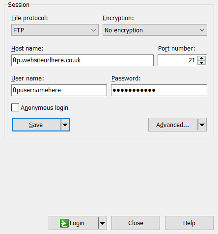

# Laravel Site Template For Yasser Hussain
This has been made by dali546. Credits to Original CSS and HTML - AJ

## Recommended Software
- Notepad++: for editing files
- WinSCP: To Upload files to the server and to manage multiple sites at once
- PuTTy: (Optional) To perform SSH commands on the server... works well with WinSCP.
Alternatively use cPanels Terminal

##Step by Step Instructions
Following this guide will make it very straightforward to create a site from the template
1. There is a file called `FINAL TEMPLATE.zip`. This contains the entire site.
2. Extract this archive into a folder (name the folder after your sitename)
3. There are only a few files that need to be edited.
   - `.env` file. this contains website configuration.
   You need modify the following lines:
   ```
       APP_NAME="INSERT SITE NAME HERE"
       APP_ENV=production
       APP_KEY=
       APP_DEBUG=false    
       APP_LOG_LEVEL=debug
       APP_URL=https://www.websiteurlhere.co.uk
       
       DB_CONNECTION=mysql
       DB_HOST=127.0.0.1
       DB_PORT=3306
       DB_DATABASE=database name here
       DB_USERNAME=cPanel Username
       DB_PASSWORD=cPanel Password
       
       MAIL_DRIVER=smtp
       MAIL_HOST=www.websiteurlhere.co.uk
       MAIL_PORT=587
       MAIL_USERNAME=info@websiteurlhere.co.uk
       MAIL_PASSWORD=rajesh30071
       MAIL_ENCRYPTION=tls
       MAIL_FROM_ADDRESS=info@websiteurlhere.co.uk
       MAIL_FROM_NAME="Name of Email"
   ```
   - `public/robots.txt` file. You need to modify the URL of the sitemaps so they match your site
   - `config/data.php` file. This contains all your site data. Modify all and any fields necessary.
        - Ensure all fields bare no reflection to the template. Keywords that need to be changed include 
        `Reading, Berkshire, 24hr Taxis, info@24hr-taxis-reading.co.uk`. Find these and replace with an alternative
        - Make sure the map URL is entered to ensure the map works. The iframe is not required just the link that starts with https
        `EG: https://www.google.com/maps/embed?pb=!1m1...!4v1549879590681`
        - 
   - `resources/views/about.blade.php | welcome.blade.php` file. Edit these files to edit the Main Paragraphs
   for the website. 
   - `app/Http/Controllers/Auth/RegisterController.php` file. This is to lock and unlock registration. This is done at the end.
   - `app/Http/Kernel.php` - LARAVEL PAGE SPEED. These middleware have been commented out until fixed by Devs -- See [Github](https://github.com/renatomarinho/laravel-page-speed/issues/89)
4. After editing the files to suit your website it is time to prepare the website.
5. Setup ftp details. Open WinSCP and create new site.
    - Have the following setup:
    
    (PuTTy) And also make sure the following setting is unticked in settings
    Untick `Tools -> Preferences -> Integration -> Applications -> Open Telnet sessions..`
6. When you have connected you should be able to view your site, and your local documents.
7. Navigate to the edited template folder. Copy all the files into the home directory of the server. 
    You should get something that looks like this
     
8. Make sure all files have been moved... If any fail just re-upload them.
9. On cPanel and click MySQL Databases. Create a database... keep the name simple.
    Please add this configuration to the `.env` file.
10. In the server files delete the folder `public_html`. Don't worry we will create it later.
11. Now Open PuTTy in WinSCP (or cPanel's Terminal).
   
12. Type the following commands one by one:
    ```angular2html
    ln -s ~/public ~/public_html
    composer install
    composer clearcache
    php artisan key:generate (enter 'y' if you get a warning)
    php artisan storage:link
    php artisan migrate:fresh (enter 'y' if you get a warning)
    exit
    ```
13. After this your site is now ready. However SSL may still not work
14. Go on cPanel and goto `Security -> SSL/TLS Status`.
    Just click run AutoSSL. it'll take a while but will generate the certificates.
15. Now you will be able to generate Sitemap. Run the following command: `php artisan command:genSitemap`    
16. Now we need to register an account for the blog
17. visit your website and manually type `/register` in the URL.
18. Register an account for the website. This will be your login for the blog
19. After registration go back on WinSCP (or cPanels File Manager). Edit the file `app/Http/Controller/Auth/RegisterController.php`
20. Change the word "guest" to "auth" to lock registration.
21. Go on cPanel and navigate to `Software -> Optimise Website`. Set it to Optimise all Content.
Done... your site is now ready to use.

*Note* - If you require "Services Page" instead of "Offers Page" then do the following
    Copy Portugal Bus Rentals Services.blade.php
    configure Navbar.blade.php - to add route to Navbar
    configure web.php routes - to add route to `views.pages.services`

### Configuration - SEO-wise 
This template has a lot of SEO customisations made. I will try and outline everything that is used.

#### laravel-page-speed
This package is installed during `composer install`. It can be configured in [app/Http/Kernel.php](app/Http/Kernel.php)

Basically it has a bunch of Middleware that can defer JS, CSS, Minify HTMl, RemoveWhitespace, do Prefetching etc
However, most of it doesn't work. Please keep an eye on [Github](https://github.com/renatomarinho/laravel-page-speed/issues/89)
for any fixes that appear. Then you can enable and improve PageSpeed. Use with Caution

#### .htaccess file
The .htaccess file has been configured in a certain way.

    # Rewrite to index.php -- Redirects index.php to "/". This is for URL neatness.
   	RewriteCond %{REQUEST_URI} !=/index.php
   	RewriteRule ^/  [L,E=rewritten:1]

    # 404 any direct access of index.php - Handles 404 errors
   	RewriteCond %{ENV:rewritten} !=1
   	RewriteCond %{ENV:REDIRECT_rewritten} !=1
   	RewriteRule ^/ - [R=404,L]

    # Force https
    RewriteCond %{HTTPS} off
    RewriteRule .* https://%{HTTP_HOST}%{REQUEST_URI} [L,R=301]

   	# Force www
   	RewriteCond %{HTTP_HOST} !^www\. [NC]
   	RewriteRule .* https://www.%{HTTP_HOST}%{REQUEST_URI} [L,R=301]

    # Sets cache for different file types.
    <IfModule mod_expires.c>
    
    # Enables gzip compression
    <ifModule mod_gzip.c>
    
    # Deflate resources
    <IfModule mod_deflate.c>

These configurations don't need to be configured but they do help SEO

#### robots.txt
This helps Google Crawler Bot to navigate the site.

    User-agent: *
    Disallow: /administration
    Disallow: /index.php
    Disallow: /css/
    Disallow: /js/
    Disallow: /svg/
    
    #TODO EDIT THESE
    sitemap: https://www./storage/images.xml
    sitemap: https://www./storage/sitemap.xml

All that is required is that the Sitemap URL needs to be set. There are two Sitemaps... One for images and one for pages.

#### cPanel configuration
cPanel offers configuration to improve optimisation. For Every Website please go to Software -> Optimise Website
and optimise the site for All MIME Type

### Understanding My Messy Code...
Ok if you're reading this then you're probably wondering what I did in my code... So I will outline every modified file

#### *app/Console/genSitemap.php*
This file generates two Sitemaps "sitemap.xml" and "images.xml" in `storage/app/public/` folder.

Sitemap is required to Google knows what files are what...
You can view the images sitemap by accessing "/storage/images.xml" in your browser or (/sitemap) defined in "web.php"

To generate this Sitemap run the following in Terminal - `php artisan command:genSitemap`
This has been Weekly Scheduled in `app/Console/Kernel.php`

#### *app/Http/Controllers/Auth/RegisterController*
This one is straight forward. Our websites only require one account to be made
so the registration needs to be locked after an account has been made.
- After registering an account at `/register`, edit this file `_contruct` method as guided
- Change the word "guest" to "auth". Meaning you need to be logged in to access the Registration Page

#### *app/Http/Controllers/ReCaptchaController.php*
This controls and Verifies the Contact Us Form. It is called from [web.php](routes/web.php)
it validates and only proceeds if criteria is met

#### *app/Http/Kernel.php*
This Kernel has been loaded with `RenatoMarinho\LaravelPageSpeed\` package. (Composer Install)
It has a bunch of SEO Middleware.

**WARNING** most have been commented out because there is a bug. Check Out the issue below:
https://github.com/renatomarinho/laravel-page-speed/issues/89

If the issue gets fixed then you can update the package `composer update` and uncomment Middleware

#### *app/Mail/...*
These are 4 Mail Files. very Sloppy but basically
- web.php checks to see if form is Valid (ReCaptchaValidator)...
- If Valid It will run `ContactSubmission` and `ContactSubmissionServer` to send an email
to the Customer and the Server Owner (defined in `.env`)
- **NOTE** GetQuote and GetQuoteServer can be deleted after iframe is implemented

#### *config/data.php*
This file is key. It contains all HTML data that has been extracted. Edit this file to update editable fields on the website
Keep an eye out for the following key things to set
    
    - $tel
    - $sitename
    - logoalt
    - contact_address
    - mapurl
    - __CITYNAME (Find & Replace)
    - __COUNTYNAME (Find & Replace)
    - Header - on the Home page (also edit the "33%" to some random %
    - faq list - Add FAQs here
    - offers list - Offers Page
    
#### *config/laralum.php*
`isSuperAdmin` allows access to Blog Admin Panel. It has been set to match the MAIL_USERNAME in `.env`
Please ensure it matches.

#### *app/recaptcha*
recaptcha has been set to V2 and the client and secret key are set in `.env`.

#### *public/.htaccess*
The .htaccess file has been mentioned above.

#### *public/robots.txt*
All that requires modifying here is the sitemap links. The URL can be modified accordingly

#### *public/google\*.html*
this file is from Google Search Console to allow monitoring of Performance.
In your google account go to Search Console... add the url of your website to the search console.
It will give you a html file to put in the public folder. It's just a key to verify your account... doesn't change.
Add it to the public directory (and then to your template.zip)

#### *resources/views*
This folder obviously contains all our pages

- 
[//]: <> (TODO Add Definitions) 


#### *routes/web.php*
Web.php contains all the routes. The first part is straight forward and returns a view

    Route::post('send_email', function (Request $request) {
        //i==1 Contact Us
        //i==2 Get Quote
        if ($request->i == 1) {
            if ((new ReCaptchaController)->store($request)) {
                Mail::send(new ContactSubmissionServer($request));
                Mail::send(new ContactSubmission($request));
                return view('pages.thanks');
            }
        } elseif ($request->i == 2) {
            Mail::send(new GetQuote($request));
            Mail::send(new GetQuoteServer($request));
            return view('pages.thanks');
        }
    })->name('send_email');
    
Both the contact us Page and HomePage Post using "send_email". when i ==1 we know it's from contact us
so it will send the first two emails and respond with the thanks page

**NOTE** this will be removed because of the new iframe. only the contact us page will be used

    Route::get('/sitemap', function (){
        return response(Storage::get('public/images.xml'), 200, [
            'Content-Type' => 'application/xml']);
    });
This simply returned the images.xml sitemap...

#### *storage/app/public/...*
This folder needs to be symlinked to the public dir
Run `php artisan storage:link`

This folder contains CSS, JS, Fonts, Images and redundant bat files (used by subscribe to newsletter)

**NOTE** Blog Images should preferably be stored in a subfolder called blog... for neatness

#### *.env*
Edit this file as mentioned in setup Instructions. You may need to update Captcha Keys (make sure its V2)

#### *composer.json*
This file contains packages required to run this template.
        
    "php": ">=7.0.0",
    "ext-dom": "*",
    "ext-simplexml": "*",
    "biscolab/laravel-recaptcha": "^2.0",
    "fideloper/proxy": "~3.3",
    "laralum/blog": "^1.3.6",
    "laravel/framework": "5.5.*",
    "me578022/simplehtmldom": "v1.11",
    "renatomarinho/laravel-page-speed": "1.8.9",
    "spatie/laravel-responsecache": "4.4.4",
    "spatie/laravel-sitemap": "3.3.1",
    "watson/sitemap": "^2.0"

Most of these are straight forward... some help SEO, some for sitemap and some is just the framework

#
This should complete all required files and knowledge on this template. 

#### Custom Services Page
Websites like [Portugal Bus rentals](https://www.portugalbusrentals.com) have a services page as opposed to Offers

To make this change it is very simple
1. Edit web.php and remove Offers route and replace with Services route
2. Connect to PortugalBusRentals via WinSCP and open `resources/views/pages/services.blade.php`
3. Copy this page to your working directory and edit to add your content
4. Update `resources/views/navbar.blade.php` to update the navigation bar. Make sure it is correct
5. Now you will have a Services Page as opposed to a Offers Page.

#### Different Logo for Header and Footer
If you need a different header and footer logo (eg logo-light and logo-dark)
then you need to edit

- `footer.blade.php`
```html
 <!-- Footer brand-->
 <div class="footer-brand"><a href="/">
```
- and `navbar.blade.php`
```html
<!-- Navbar Brand-->
<div class="rd-navbar-brand"><a href="{{route('welcome')}}">
    
    ...
        <!-- Navbar Brand Mobile-->
            <div class="rd-navbar-mobile-brand"><a href="{{route('welcome')}}">
                
```

This will update the header and footer images.

#LEGACY GUIDE
#### IGNORE INSTRUCTIONS BUT NOTES ARE STILL USEFUL
- Requires at least PHP 7.0.33, with the necessary PHP Extensions enabled.
- Between 30Mb - 80Mb Hard Drive Space
- MySQL Capability

- Ensure the server is correctly setup. Initialise a database in MySQL. give it a name.
- Now push this whole directory to the server. you can do this with PhpStorm.. or upload zip file through cPanel and extract to home dir
- Once extracted your directories should look like...
  
- You will also have the "public" folder from this template...
- Now delete public_html... Don't worry we'll make a new one
- Since cPanel likes using public_html we will create a link to the "public" folder of laravel...
- from the terminal type `ln -s ~/public ~/public_html`. This will create a symlink and if you go inside the folder you should end up in public folder.
- One more symlink is required. type `ln -s ~/storage/app/public ~/public/storage`. This will have all files.
- Next open and edit the .env file. Update it as below.
    ```
    E.G.
    APP_NAME=    APP_ENV=    APP_KEY=    APP_DEBUG=    APP_LOG_LEVEL=debug
    APP_URL=    
    DB_CONNECTION=mysql
    DB_HOST=127.0.0.1
    DB_PORT=3306
    DB_DATABASE=    DB_USERNAME=    DB_PASSWORD=    
    MAIL_DRIVER=smtp
    MAIL_HOST=    MAIL_PORT=    MAIL_USERNAME=    MAIL_PASSWORD=    MAIL_ENCRYPTION=tls
    MAIL_FROM_ADDRESS=    MAIL_FROM_NAME="Name of Email"
    ```
- One the .env file has been setup your site is ready to go.
- Open terminal and type `composer install`. This will install everything. You have to make sure all necessary
    php extensions are installed or it will fail. This can be done through WHM Apache 4. After saving try again.
- When completed, you will need to run `php artisan key:generate` to generate a key.
- Run `composer clearcache` to delete install files (around 300Mb).
- **NOTE** This step is only for Laralum Blog.
    - Run `php artisan vendor:publish` and publish the following providers (just enter the corresponding number one by one)
    ```
    Laralum\Blog\BlogServiceProvider
    Laralum\Files\FilesServiceProvider
    Laralum\Laralum\LaralumServiceProvider
    ```
    - Run `php artisan migrate:fresh` and then `php artisan db:seed`. This builds the tables.
- Just visit your website and see if it works. The blog should work but login will not work yet.

Just to get a user setup, for Laralum blog
- Go to `app/Http/Controllers/Auth/RegisterController.php`
- Open the file and edit this line
    - In the `__construct` function, change the word "auth" to "guest".
    - visit /register to register an account.
    - After you are done then revert the change to lock registration.
- Then this needs to be set for Laralum. Go to `config/Laralum.php`
- Edit this part of the file

        'superadmins' => [
                'ENTER YOUR EMAIL HERE',
            ],
- Save the file and voila... sorted. visit /login. Login and then follow the link to Admin Panel... you should be inside Laralum.
- If you wish to remove the blog, please scroll down and find out how.

- The sitemap needs all these composer packages (already installed)
    ```
    "me578022/simplehtmldom": "v1.11",
    "spatie/laravel-sitemap": "3.3.1",
    "ext-dom": "*",
    "ext-simplexml": "*"
    ```
- To generate the Sitemap please type into the console
`php artisan command:genSitemap`
- The Image Sitemap will be found in `public/storage/images.xml`. it can easily be accessed by visiting /sitemap.
- The Basic Sitemap can be found in `public/storage/sitemap.xml`. No easy access for this file.
- This script can be set to run on a schedule. You can add the following line to "app/Console/Kernel.php"
  ```
  protected function schedule(Schedule $schedule) {
          $schedule->command('genSitemap')->daily();
  }
  ```  
This Sitemap requires both watson/sitemap & spatie/sitemap... It's very weird but spatie can crawl the site, but can't find images
and watson can find format links for Google Images SEO. so just stick with it.


On the off chance you don't want the blog... follow the instructions below. 
Instead of the complete package use the excluding_blog template.
Here are the manual instructions to remove it
- Remove the package "laralum:blog" from `composer.json`
- Remove `config/laralum.php`
- Disable Authentication remove the following two lines from `routes/web.php`
    ```
    Auth::routes();
    Route::get('/home', 'HomeController@index')->name('home');
    ```
- Remove the following two lines from `resources/views/layouts/navbar.blade.php`
```$xslt
<li {{ Request::is('blog') ? 'class=active' : null }}><a href="{{'blog'}}">Blog</a></li>
<li>{{ Request::is('login') ? 'class=active' : null }}<a href="{{route('login')}}">Login</a>
```
- Remove the following line from `resources/views/home.blade.php`
```
<a href="{{route('laralum::dashboard')}}">Go to Admin Panel</a>
```
**The Alternative to this package is to use cPanel's Wordpress plugin, and redirect it to "/blog".**

To Remove any need for Logging in etc Please do the above for removing Laralum then this
- Remove the following files
```
resources/views/auth
resources/views/home.blade.php
resources/views/layouts/app.blade.php
```
- Remove inside `routes/web.php` the following lines
```$xslt
Auth::routes();
Route::get('/home','HomeController@index')->name('home');
```
- Edit the file `app/Http/Controllers/HomeController.php`.
```
public function index() {
    return view('pages.welcome');
}
```
- Run the command `php artisan migrate:refresh`... Warning this will delete ALL blog posts.

copy and paste this into .htaccess
```
# Force https
RewriteCond %{HTTPS} off
RewriteRule .* https://%{HTTP_HOST}%{REQUEST_URI} [L,R=301]
    
# Force www
RewriteCond %{HTTP_HOST} !^www\. [NC]
RewriteRule .* https://www.%{HTTP_HOST}%{REQUEST_URI} [L,R=301]
```

Once deployed modify .env file with details of stmp driver of cPanel.
Their are 4 emails that have been set. 2 for the customer, 2 for the Server Owner. They are found in app/Mail.
The layout of these are written in Markdown. these are found in `resources/views/mail`.
Please ensure your lines aren't indented as Markdown interprets these as blockquotes.

the folders should be mapped onto server pretty much the same. only public folder is moved.
keep all other folders out of public... for security.
- **template -> server**
- \app\ -> ~/app/
- \bootstrap\ -> ~/bootstrap/
- \config\ -> ~/config/
- \database\ -> ~/database/
- \public\ -> ~/public/ --The public_html directory should be deleted. and made into a symlink to the public folder
- \resources\ -> ~/resources/
- \routes\ -> ~/routes/
- \storage\ -> ~/storage/
- \vendor\ -> ~/vendor/


I hope you found all this useful... If it still fucks up msg me.

@Dali546
